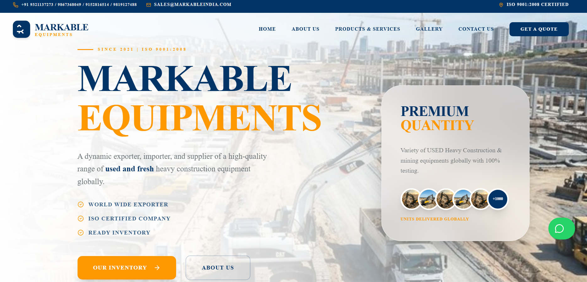
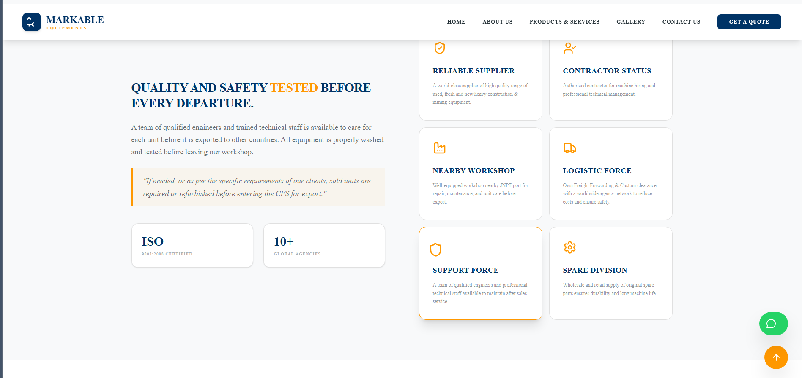
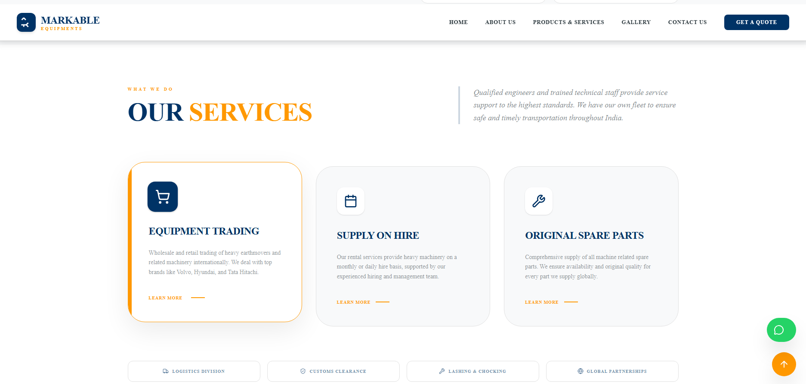
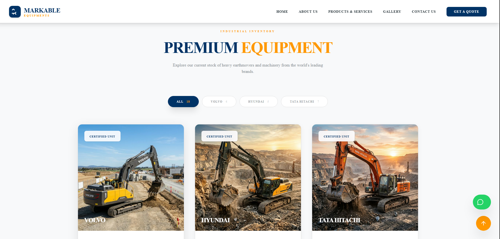
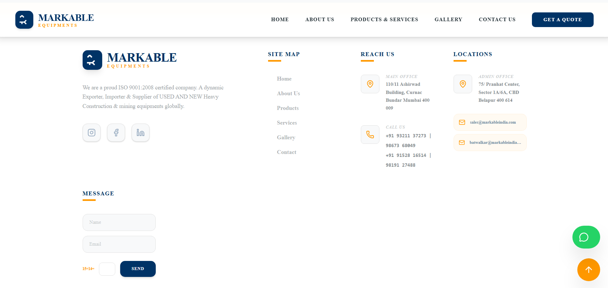

# Markable Redesign

A premium, modern, and responsive redesign of the Markable India website, built using React and Vite. This project focuses on a sleek industrial aesthetic with a focus on visual impact and user experience.

## Project Screenshots

Below are some of the key design elements and sections of the redesigned platform:

### Hero & Featured Sections

### Industrial Solutions

### Services & Expertise

### Modern Interface

### Responsive Design

---
